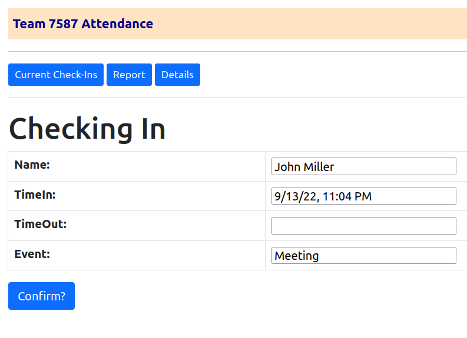

# Team 7587 Attendance System
This is a cloud-based web application used to manage Team 7587's attendance.

## Key Components

* Springboot web application, hosted in Apache on AWS EC2
* Thymeleaf front-end
* MySql database hosted in AWS RDS

## Features
* Restful endpoints, secured by Spring security
* Attendance recording via automatic QR code scan
* Easy on-screen and downloadable reports

## Usage
Access the application here:

http://ec2-3-86-77-191.compute-1.amazonaws.com:8080/attendance7587/

* If not yet authenticated, you'll be prompted for your credential.
* Generate QR codes for each team member at https://www.qrcode-monkey.com/, using a URL like following:
```
https://ec2-3-86-77-191.compute-1.amazonaws.com:8080/attendance7587/scanCheck/firstName%20lastName
```
* Scan the QR code with your phone, and the browser will open the attendance entry form and automatically record the current time, click 'Confirm?' to save it.



